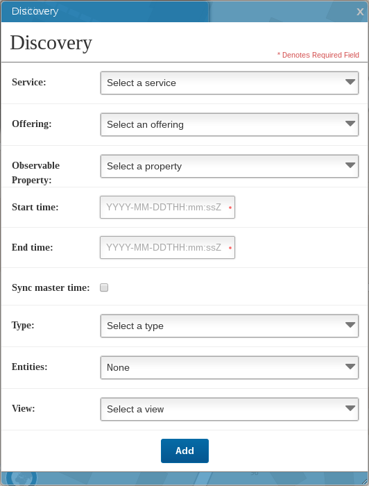

Use the discovery view
===

## What is it for?

The discovery view is a service allowing one to automatically discover SOS stream provided by an OSH server.
It simplifies the action of reading GetCapabilities, creating/instantiating the DataReceiver as well as the View.
For now, the discovery service is able to:

 * Select a service
 
 * Select an offering
 
 * Select an observableProperty
 
 * Select Time (start/end)
 
 * Sync master time or not
 
 * Attach to an existing entity
 
 * The kind of view
 

 
## Extends the discovery service feature

The view allows you to extend the basic functionnality to fit as much as possible to your needs:

```javascript
 var discoveryView = new OSH.UI.DiscoveryView("",{
        services: ["<host1>","<host2>"],
        css: "discovery-view",
        dataReceiverController:dataProviderController,
        swapId: "center-container",
        entities: [<some entity>],
        views: [{
            name: 'Leaflet 2D Map',
            viewId: leafletMainView.id,
            type : OSH.UI.DiscoveryView.Type.MARKER_GPS
        }, {
            name: 'Cesium 3D Globe',
            viewId: cesiumMainMapView.id,
            type : OSH.UI.DiscoveryView.Type.MARKER_GPS
        },{
            name: 'Video dialog(H264)',
            type : OSH.UI.DiscoveryView.Type.DIALOG_VIDEO_H264
        },{
            name: 'Video dialog(MJPEG)',
            type : OSH.UI.DiscoveryView.Type.DIALOG_VIDEO_MJPEG
        },{
            name: 'Chart dialog',
            type : OSH.UI.DiscoveryView.Type.DIALOG_CHART
        }
        ]
    });
```
The `services` property is the endpoint url of the different servers you want to discover the services.
Like the other views, the discovery view can be styled using the `css` property. You can specify 
an existing `dataReceiverController` if you have one, otherwise, the data source will be independently connected.
Once the offering and observedProperty discovered, the final data receiver can be attached to an existing entity using
the `entities` property.

The `views` array provides a way to create automatically a view linked to your data source. For the moment, only a few views are available
but you can extend the discovery view to add more.

The `viewId` is the div id to attach your view, you can select an existing one (the one from your application, an existing dialog etc.) 
or uses the `OSH.UI.DiscoveryView.Type.DIALOG_*` which will popup a new dialog window.

[See more types..](http://opensensorhub.github.io/osh-js/Toolkit/Documentation/OSH.UI.DiscoveryView.html#.Type)